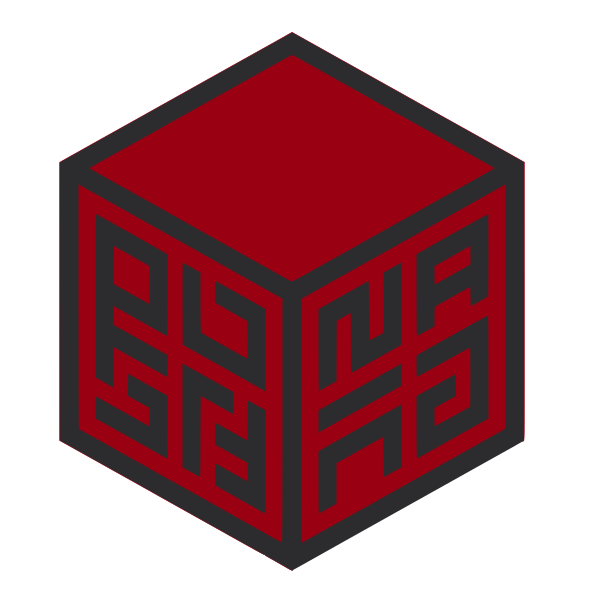

<p align="center">
  
</p>

<h1 align="center">poneglyph</h1>
<p align="center"><em>Local, persistent memory for coding agents.</em></p>

<p align="center">
  
  
  
</p>

poneglyph gives Claude Code, Cursor, OpenCode, Codex, and Copilot CLI a
memory that survives between sessions, plus a code knowledge graph they can
query instead of grepping. One binary, SQLite, local embedding model —
everything offline unless you opt into LLM enrichment.

## Why "poneglyph"?

In *One Piece*, poneglyphs are indestructible stone tablets that record
history the World Government tried to erase — knowledge too important to
lose, carved somewhere it can't be deleted. That's the job this does for
your agent: project memory that survives context resets and new sessions
instead of starting from zero every time.

## Features

**Memory**
- Hybrid retrieval — dense embeddings + FTS5 keyword search + 1-hop graph
  expansion, fused with RRF
- Knowledge graph — explicit, similarity, temporal, and tag-overlap edges,
  plus optional LLM-labeled relations
- Zero-token context injection — ranked project memory loaded into a new
  session, no LLM calls
- Passive capture — Claude Code hooks and the OpenCode plugin record tool
  calls, prompts, and replies automatically

**Code intelligence**
- Tree-sitter code graph — callers, callees, imports, and tests across
  Rust, TypeScript, JavaScript, Python, and Go
- `codegraph_query` / `codegraph_blast_radius` — agents trace impact
  through real call/import edges instead of grepping text
- Self-healing — a debounced hook keeps the graph current after every
  edit; no separate watch process to remember to run

**Running it**
- MCP server (`poneglyph mcp`) — 6 memory tools + 2 codegraph tools for
  any MCP-aware client
- Web dashboard (`poneglyph viewer`) — GPU-rendered (WebGL) graph explorer
  that scales past what a DOM renderer can handle, plus search, timeline,
  and settings
- Fast local embeddings — `all-MiniLM-L6-v2` by default (384d), fully
  offline after first model download
- Optional LLM enrichment — summarize, extract entities/relations, score
  importance, semantic compression; off by default, opt-in per provider
  at build time

## Quick start

1. **Install** — grabs a prebuilt binary for your platform (falls back to
   building from source), then runs `poneglyph init`:
   ```sh
   curl -fsSL https://raw.githubusercontent.com/brilyyy/poneglyph/main/scripts/install.sh | bash
   ```
2. **Run the MCP server** for your editor/agent:
   ```sh
   poneglyph mcp
   ```
3. **Or open the web dashboard** (separate process):
   ```sh
   poneglyph viewer
   open http://127.0.0.1:3742
   ```

### Build from source

```sh
git clone https://github.com/brilyyy/poneglyph.git
cd poneglyph
cargo build --release
./target/release/poneglyph init
./target/release/poneglyph mcp      # MCP, for editor/agent integration
```

LLM-backed enrichment/compression is opt-in per provider and not compiled in
by default — add `--features llm-openai`, `llm-anthropic`, `llm-gemini`, or
the `llm-all` bundle to `cargo build` if you want it.

## Demo

```sh
# Seed sample data and view in browser
./target/release/poneglyph demo
./target/release/poneglyph viewer
open http://127.0.0.1:3742
```

## Documentation

- [INSTALL.md](docs/INSTALL.md) — build from source, configuration, first run
- [INTEGRATIONS.md](docs/INTEGRATIONS.md) — Claude Code, Claude Desktop, OpenCode setup
- [CODEGRAPH.md](docs/CODEGRAPH.md) — code knowledge graph CLI, `.poneglyphignore`, MCP tools, dashboard
- [COMPRESSION.md](docs/COMPRESSION.md) — semantic compression pipeline
- [MIGRATION.md](docs/MIGRATION.md) — schema migration guide
- [CHANGELOG.md](CHANGELOG.md) — notable changes by phase
- [PRD](docs/poneglyph_PRD.md) — full product requirements document

## Architecture

<details>
<summary>Crate and directory layout</summary>

```
poneglyph-cli       ── clap binary (init, mcp, viewer, remember, recall, demo, ...)
poneglyph-http      ── axum server (/ingest, /api/*, embedded viewer)
poneglyph-mcp       ── rmcp stdio server (8 tools: memory + codegraph)
poneglyph-core      ── store, embed, retrieve, graph, codegraph, compress, enrich, llm, config
viewer/             ── TanStack Router + React SPA; graph views render via cosmos.gl (WebGL)
hooks/claude-code/  ── bash hooks (posttooluse, userpromptsubmit, stop, sessionstart)
hooks/opencode/     ── TypeScript plugin (pure MCP, no HTTP dependency)
skills/poneglyph/   ── Claude Code / OpenCode skill (SKILL.md)
```

</details>

## Configuration

TOML at `~/.config/poneglyph/config.toml` (XDG). Key settings:

| Setting | Default | Purpose |
|---|---|---|
| `dashboard.port` | `3742` | `poneglyph viewer` HTTP port |
| `embedding.model_id` | `sentence-transformers/all-MiniLM-L6-v2` | Embedding model (384d) |
| `llm.enabled` | `false` | Optional LLM enrichment (also needs a matching `--features llm-*` build) |
| `enrichment.enabled` | `false` | Enable enrichment jobs |

## License

MIT
